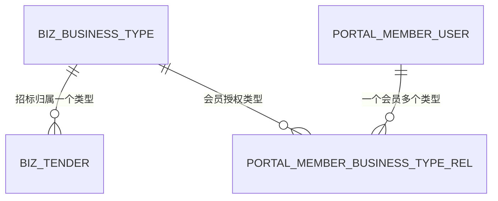

# 业务类型与可见范围

## 业务类型是什么

业务类型是会员和招标之间的授权维度。默认种子数据包括：

| code | name | sortOrder |
| --- | --- | --- |
| `ENGINEERING` | 工程 | 10 |
| `GOODS` | 货物 | 20 |
| `SERVICE` | 服务 | 30 |

业务类型不是 Java 枚举，而是数据库业务数据，后台可以新增、修改、停用。

## 数据关系

## 后台管理规则

新增/编辑：

- 编码、名称必须唯一。
- 编码会统一转大写。
- 未传排序时，默认取当前最大排序 + 10。
- 启用状态由请求布尔值决定。

停用：

- 停用后不能再用于新建/编辑会员或招标。
- 已有历史关系不会自动删除。

删除：

- 只有未被会员和招标引用时才能删除。
- 已被引用时后端返回：`该类型已被会员或招标引用，请先停用，不能删除`。

## 对会员的影响

会员启用前必须至少绑定一个启用中的业务类型。

会员登录时：

- 后端只取启用中的业务类型。
- 如果没有启用中的业务类型，登录失败，提示 `账号未分配可用业务类型，请联系管理员`。

会员列表查询时：

- 只返回会员已授权业务类型范围内的招标。
- `businessTypeName` 只是授权范围内的名称过滤，不会扩大访问范围。

## 对招标的影响

后台创建或编辑招标时：

- `businessTypeId` 不能为空。
- 指向的业务类型必须存在。
- 指向的业务类型必须启用。

门户展示时：

- 游客最新 3 条不按会员业务类型过滤。
- 会员分页列表按会员业务类型过滤。
- 详情正文公开给游客和会员，只要求招标已发布且发布时间已到。
- 附件下载严格要求会员业务类型包含招标业务类型。

## 操作建议

- 新增业务类型前先确认名称和编码口径，避免后续门户筛选出现重复分类。
- 不再使用的类型优先停用，不要急着删除。
- 如果某会员反馈看不到招标，先查会员业务类型和招标业务类型是否匹配。
- 如果某会员能看详情但不能下载附件，继续查下载权限 `canDownloadFile` 和附件归属。
