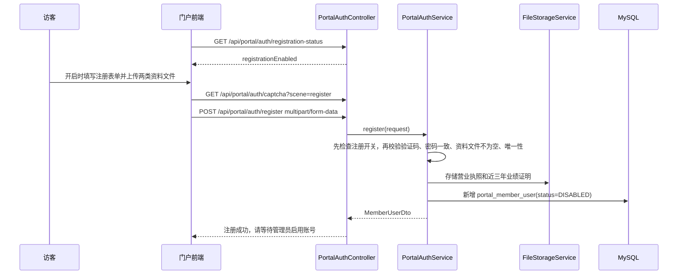
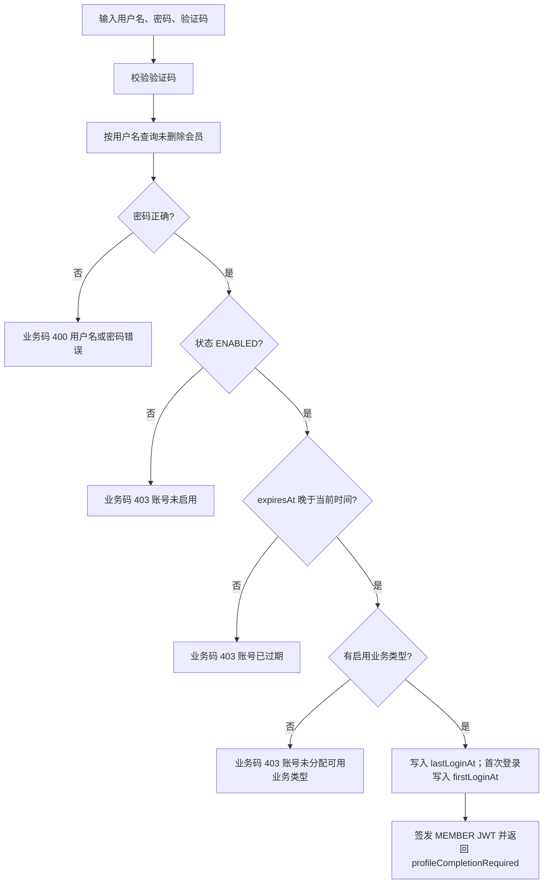

# 会员准入与门户使用

## 业务目标

会员是门户的受控访问主体。系统默认允许门户自注册，但后台可不定期关闭注册入口；注册成功不等于可登录和下载，后台管理员必须完成业务类型、过期时间、启用状态和下载权限配置。

## 代码入口

| 能力 | 后端入口 | 服务层 | 前端页面 |
| --- | --- | --- | --- |
| 门户验证码 | `PortalAuthController.captcha` | `CaptchaService` | `front/src/views/LoginView.vue`, `RegisterView.vue` |
| 注册开关状态 | `PortalAuthController.registrationStatus` | `MemberRegistrationSettingService` | `front/src/views/LoginView.vue`, `RegisterView.vue` |
| 门户注册 | `PortalAuthController.register` | `PortalAuthService.register` | `front/src/views/RegisterView.vue` |
| 门户登录 | `PortalAuthController.login` | `PortalAuthService.login` | `front/src/views/LoginView.vue` |
| 当前会员 | `PortalAuthController.me` | `PortalAuthService.currentMember` | `front/src/auth/index.js`, `SettingView.vue` |
| 会员资料文件 | `PortalAuthController.uploadProfileFiles` | `FileStorageService` | `front/src/views/SettingView.vue` |
| 更新会员资料 | `PortalAuthController.updateProfile` | `PortalAuthService.updateCurrentMember` | `front/src/views/SettingView.vue` |
| 会员修改密码 | `PortalAuthController.changePassword` | `PortalAuthService.changeCurrentMemberPassword` | 待前端接入 |
| 后台会员管理 | `MemberAdminController` | `MemberAdminService`, `MemberRegistrationSettingService` | `frontend/src/pages/sys/member/index.vue` |

## 会员注册开关

- 设置键：`portal.member.registration.enabled`。
- 存储表：`sys_application_setting`。
- 默认值：缺少配置或迁移初始状态均视为 `true`，保持现有注册开放口径。
- 门户公开查询：`GET /api/portal/auth/registration-status`，返回 `data.registrationEnabled`。
- 后台查询：`GET /api/admin/members/registration-setting`，需要 `SYSTEM_MEMBER_USER`。
- 后台修改：`PUT /api/admin/members/registration-setting`，请求体 `{"registrationEnabled": false}`，需要 `MEMBER_REGISTRATION_SETTING_BUTTON`。
- 关闭注册只影响门户自助注册提交；后台创建会员、已存在会员登录、会员资料维护不受影响。

## 门户自注册流程

注册必填：

- 用户名：4-64 位。
- 手机号：`^1\d{10}$`。
- 邮箱：合法邮箱。
- 公司名称。
- 联系人。
- 统一社会信用代码：18 位数字或大写字母。
- 密码和确认密码：6-32 位，必须一致。
- 验证码标识和验证码。
- 营业执照文件。
- 近三年业绩证明文件。

注册成功后的默认状态：

| 字段 | 默认值 | 业务含义 |
| --- | --- | --- |
| `status` | `DISABLED` | 不能立即登录 |
| `canDownloadFile` | `false` | 不能下载附件 |
| `businessTypes` | 空 | 没有可见业务类型 |
| `expiresAt` | 空 | 视为不可登录，后台必须设置 |
| 资料文件 | 已保存并绑定 | 后台可查看/下载 |

## 后台启用会员流程

管理员需要完成：

1. 打开会员详情。
2. 核对企业资料和两类资料文件。
3. 分配至少一个启用中的业务类型。
4. 设置会员过期时间 `expiresAt`。
5. 将状态改为 `ENABLED`。
6. 如允许下载附件，开启 `canDownloadFile`。

启用前校验：

- `status=ENABLED` 时，业务类型不能为空。
- `status=ENABLED` 时，过期时间不能为空。
- 业务类型必须存在且启用。

## 门户登录流程

首次登录：

- 如果 `firstLoginAt` 为空，本次登录写入当前时间。
- 响应 `profileCompletionRequired=true`。
- 门户登录页会跳转到账户设置页，引导完善资料。

## 会员资料维护

会员可在门户“账户设置”维护：

- 手机号。
- 邮箱。
- 公司名称。
- 联系人。
- 统一社会信用代码。
- 真实姓名。
- 营业执照文件。
- 近三年业绩证明文件。

文件更新方式：

1. 调用 `POST /api/portal/auth/profile/files` 上传文件，得到 fileId。
2. 调用 `PUT /api/portal/auth/profile`，传 `businessLicenseFileId` 或 `threeYearPerformanceFileId`。
3. 不传或传 null 表示保持原文件。

唯一性校验：

- 用户名、手机号、邮箱、统一社会信用代码在未删除会员中必须唯一。
- 后台编辑时允许保持当前会员自己的原值。

## 会员自助修改密码

后端已提供门户会员自助修改密码接口：

- 路径：`PUT /api/portal/auth/password`。
- 权限：当前登录会员，`Authorization: Bearer <member-token>`，要求 `MEMBER`。
- 请求体：`oldPassword`、`password`、`confirmPassword`。
- 规则：旧密码必须正确；新密码 6-32 位；新密码和确认密码必须一致。
- 返回：成功时 `data=null`，业务消息为“修改密码成功”。

这个能力属于门户会员自己的账号安全操作，不走后台菜单/按钮权限，也不要求 `MEMBER_PASSWORD_BUTTON`。`MEMBER_PASSWORD_BUTTON` 仍只表示后台管理员在会员管理里重置会员密码。

## 后台会员删除

当前删除是软删除：

- `deleted=true`。
- `deletedAt=当前时间`。
- 列表和详情只查未删除会员。
- 登录只查未删除会员。

软删除的价值：

- 保留历史数据痕迹。
- 通过 active 唯一索引支持删除后重新注册或创建同名/同手机号/同邮箱/同信用代码会员。

## 门户使用联动

| 场景 | 前端动作 | 后端约束 |
| --- | --- | --- |
| 未登录看列表 | 调用 `/api/portal/tenders/latest` | 只返回最新 3 条公开招标 |
| 登录成功 | 保存 token，重新拉列表 | 列表改用 `/api/portal/tenders` |
| 首次登录 | 跳账户设置 | `profileCompletionRequired=true` |
| 点下载附件 | 带 token 请求下载接口 | 校验业务类型和 `canDownloadFile` |
| 账号禁用或过期后继续用旧 token | 请求受保护接口 | 用户详情服务拒绝认证，表现为未登录或无权限 |

## 测试关注点

- 注册验证码错误、缺资料文件、重复手机号/邮箱/信用代码。
- 注册后不能直接登录。
- 后台启用前缺业务类型或过期时间会失败。
- 过期会员不能登录。
- 首次登录和二次登录的 `profileCompletionRequired` 不同。
- 会员资料更新时不传文件 ID 应保持原文件。
- 会员修改密码必须校验旧密码；旧密码登录应失败，新密码登录应成功。
