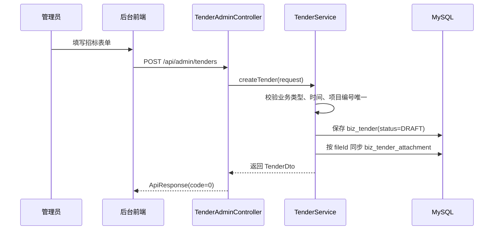

# 招标业务全流程

## 业务目标

后台管理员维护招标公告和附件；门户游客可看公开招标摘要和详情；会员登录后按业务类型看列表，并在满足权限时下载附件。

## 代码入口

| 层 | 文件 |
| --- | --- |
| 后台接口 | `src/main/java/com/zhaobiao/admin/controller/TenderAdminController.java` |
| 门户接口 | `src/main/java/com/zhaobiao/admin/controller/PortalTenderController.java` |
| 后台服务 | `src/main/java/com/zhaobiao/admin/service/TenderService.java` |
| 门户服务 | `src/main/java/com/zhaobiao/admin/service/PortalTenderService.java` |
| 实体 | `Tender`, `TenderAttachment`, `TenderFileStorage`, `BusinessType` |
| 前端后台页 | `frontend/src/pages/sys/tender/index.vue` |
| 门户页 | `front/src/views/ListView.vue`, `front/src/views/DetailView.vue`, `front/src/views/CategoryTendersView.vue` |

## 后台字段

| 字段 | 业务含义 | 关键规则 |
| --- | --- | --- |
| `title` | 招标标题 | 必填，门户和后台列表展示 |
| `region` | 地区 | 可用于后台和门户筛选 |
| `businessTypeId` | 业务类型 | 必须是启用中的业务类型 |
| `publishAt` | 发布时间 | 不能晚于项目截止时间；门户只展示已到发布时间的数据 |
| `content` | 招标正文 | 门户详情展示正文 |
| `contactPerson` | 联系人 | 门户详情展示 |
| `budget` | 预算 | 当前是字符串字段，按展示文本处理 |
| `contactPhone` | 联系电话 | 门户详情展示 |
| `tenderUnit` | 招标单位 | 列表和详情展示 |
| `deadline` | 项目截止时间 | 报名截止和发布时间都不能晚于它 |
| `projectCode` | 项目编号 | 全局唯一 |
| `signupDeadline` | 报名截止时间 | 不能晚于项目截止时间 |
| `status` | 状态 | 新增固定 `DRAFT`，发布状态只能由 status 接口调整 |

## 后台新增草稿



关键细节：

- `createTender` 会忽略请求里的发布意图，创建时强制 `DRAFT`。
- `projectCode` 不能重复。
- 如果传入 `attachmentFileIds`，后端会按顺序绑定附件。
- 绑定附件时，重复 fileId 会去重，fileId 为空会返回业务错误。

## 后台编辑草稿

可编辑条件：

- 招标存在。
- 当前状态不是 `PUBLISHED`。
- 请求不能偷偷改变 `status`；状态只能走专用 status 接口。

不能编辑的情况：

| 情况 | 后端返回 |
| --- | --- |
| 招标不存在 | 业务码 404，`招标不存在` |
| 已发布招标直接编辑 | 业务码 400，`已发布招标请先改为未发布后再操作` |
| 请求体里状态和当前状态不一致 | 业务码 400，`招标发布状态请通过发布状态接口调整` |
| 项目编号重复 | 业务码 400，`项目编号已存在` |

## 发布与取消发布

发布接口：

```text
PUT /api/admin/tenders/{tenderId}/status
Body: { "status": "PUBLISHED" }
权限: TENDER_PUBLISH_BUTTON
```

取消发布接口：

```text
PUT /api/admin/tenders/{tenderId}/status
Body: { "status": "DRAFT" }
权限: TENDER_PUBLISH_BUTTON
```

当前 status 接口只允许 `DRAFT` 和 `PUBLISHED`，不允许设置 `CLOSED`。

发布后的保护：

- 不能编辑。
- 不能删除。
- 不能追加附件。
- 不能删除附件。
- 如需修改，先改回 `DRAFT`。

## 附件绑定与清理

附件上传和绑定是两步：

1. 上传文件到 `/api/admin/files/upload`，返回 fileId。
2. 创建/编辑招标时传 `attachmentFileIds`，或调用 `/api/admin/tenders/{tenderId}/attachments` 追加。

清理规则：

- 删除招标或移除附件时，会删除 `biz_tender_attachment` 关联。
- 文件记录只有在没有招标附件引用、没有会员资料文件引用、没有资讯封面引用时，才会删除 `biz_file_storage` 和物理文件/OSS 对象。
- 同一文件按 SHA-256 内容哈希去重，重复上传会复用已有文件记录。

## 门户展示规则

游客：

- `GET /api/portal/tenders/latest` 只返回最新 3 条。
- 查询条件是 `status=PUBLISHED` 且 `publishAt <= now`。
- 不按业务类型过滤。
- 可查看详情正文和附件元信息。
- `canDownload=false`。

会员：

- `GET /api/portal/tenders` 要求 `MEMBER` 角色。
- 会员必须有启用中的业务类型。
- 列表只返回与会员业务类型有交集的招标。
- 可用 `keyword`、`region`、`businessTypeName` 过滤，但 `businessTypeName` 仍被限制在会员已授权类型范围内。

详情：

- `GET /api/portal/tenders/{tenderId}` 对游客开放。
- 详情只要求招标 `PUBLISHED` 且 `publishAt <= now`。
- 当前实现允许会员通过详情 URL 查看非自己业务类型的公开正文；附件下载仍严格受业务类型控制。

## 附件下载规则

下载接口：

```text
GET /api/portal/tenders/{tenderId}/attachments/{attachmentId}/download
权限: MEMBER
```

必须全部满足：

- token 有效，且是会员 token。
- 会员未禁用、未过期。
- 会员拥有启用中的业务类型。
- 招标已发布且发布时间已到。
- 招标业务类型在会员业务类型列表中。
- 会员 `canDownloadFile=true`。
- 附件属于该招标。

失败提示：

- 未登录下载由 Spring Security 返回 401。
- 登录后无下载权限、业务类型不匹配或禁止下载，返回业务码 403，消息为 `当前账号暂无附件下载权限`。

## 测试关注点

- 新建招标固定为 `DRAFT`。
- 无 `TENDER_PUBLISH_BUTTON` 不能发布。
- 已发布招标拒绝编辑、删除、增删附件。
- 游客只能看到最新 3 条列表，但能看公开详情正文。
- 会员列表必须按业务类型过滤。
- 附件下载必须同时覆盖业务类型、下载权限、禁用和过期。
