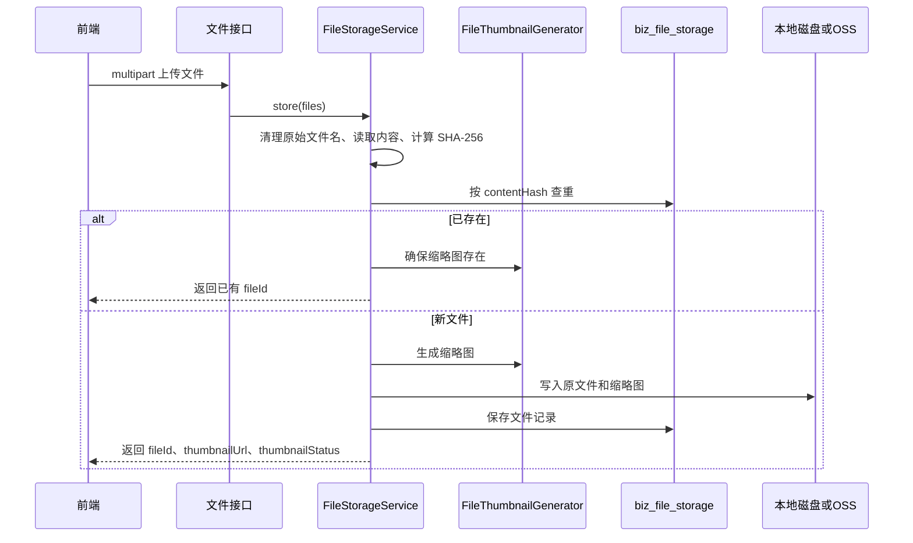

# 文件上传预览下载

## 文件用途

系统里的文件统一记录在 `biz_file_storage`，但业务用途不同：

| 用途 | 绑定表/字段 | 上传入口 |
| --- | --- | --- |
| 招标附件 | `biz_tender_attachment.file_storage_id` | `/api/admin/files/upload` |
| 资讯封面 | `biz_news.cover_file_id` | `/api/admin/files/upload` |
| 后台会员资料文件 | `portal_member_user.business_license_file_id`, `three_year_performance_file_id` | `/api/admin/members/profile-files` |
| 门户会员资料文件 | 同上 | `/api/portal/auth/profile/files` |

## 存储模式

由 `APP_FILE_TYPE` 决定：

| 模式 | 服务类 | 存储位置 |
| --- | --- | --- |
| `local` | `LocalFileStorageService` | 本机目录，默认 `./.uploads/files` |
| `oss` | `OssFileStorageService` | 阿里云 OSS，默认 key 前缀 `zb/files` |

前端不能拼本地路径、OSS bucket 或 object key，只能通过后端 fileId 访问。

## 上传流程



上传返回：

- `fileId`
- `fileName`
- `contentType`
- `fileSize`
- `thumbnailUrl`
- `thumbnailContentType`
- `thumbnailStatus`

## 缩略图规则

缩略图接口：

```text
GET /api/files/{fileId}/thumbnail
公开访问
缓存: public, max-age=7天
```

生成规则：

| 文件类型 | 结果 |
| --- | --- |
| 图片 | 按最大 320x240 等比缩放生成 JPEG |
| PDF | 渲染第一页，按最大 320x240 生成 JPEG |
| 其他类型 | 生成带扩展名标签的类型封面，状态 `UNSUPPORTED` |
| 读取或解析失败 | 生成类型封面，状态 `FAILED` |

缩略图缺失时，本地和 OSS 服务都会尝试从原文件重新生成。

## 后台下载和页内查看

后台文件下载：

```text
GET /api/admin/files/{fileId}/download
权限: TENDER_UPLOAD_BUTTON 或 NEWS_UPLOAD_BUTTON 或 MEMBER_CREATE_BUTTON 或 MEMBER_EDIT_BUTTON
Content-Disposition: attachment
```

后台页内查看：

```text
GET /api/admin/files/{fileId}/view
权限同下载
Content-Disposition: inline
```

前端责任：

- PDF 翻页、图片展示、文本展示、Office 不支持在线预览等由前端控件决定。
- 后端只返回完整文件流。
- 预览失败时应显示明确错误，不要拼接 storagePath。

## 门户附件下载

门户下载只用于招标附件：

```text
GET /api/portal/tenders/{tenderId}/attachments/{attachmentId}/download
权限: MEMBER
```

下载条件：

- 会员 token 有效。
- 招标已发布且发布时间已到。
- 附件属于该招标。
- 会员业务类型包含招标业务类型。
- 会员 `canDownloadFile=true`。
- 会员未禁用、未过期。

## 文件清理

删除招标或移除招标附件时，后端会尝试清理不再引用的文件。清理前会检查：

- 是否仍被其他招标附件引用。
- 是否仍被会员营业执照或三年业绩文件引用。
- 是否仍被资讯封面引用。

只有三类引用都不存在，才删除物理文件/OSS 对象和 `biz_file_storage` 记录。

## 风险点

- 同一文件内容复用同一 `biz_file_storage`，不要把 fileId 当成“只属于某一个业务”的私有文件。
- 删除文件引用前必须考虑资讯封面和会员资料文件。
- OSS bucket、endpoint、key prefix 改动会影响历史对象访问，不是单纯改环境变量。
