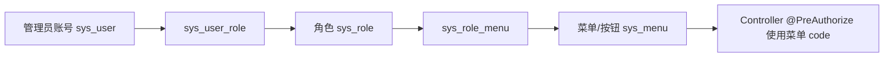

# 账号权限与后台管理

## 账号线

系统有两条账号线，不能混用：

| 账号线 | 表 | 登录接口 | Principal | 使用场景 |
| --- | --- | --- | --- | --- |
| 管理员 | `sys_user` | `POST /api/auth/login` | `LoginUser` | 后台管理端 |
| 会员 | `portal_member_user` | `POST /api/portal/auth/login` | `MemberLoginUser` | 会员门户端 |

JWT 中包含 `userType`，过滤器按 `userType` 选择管理员或会员详情服务。管理员 token 不能当会员 token 用，会员 token 也不能进入后台接口。

## 当前权限模型

当前客户可理解的权限模型是：



关键点：

- 角色绑定菜单/按钮。
- 按钮也是菜单树节点，`type=BUTTON`。
- 技术授权编码直接使用 `sys_menu.code`。
- `sys_permission` 仍在代码中，但当前权限管理接口已停用，不是主授权模型。
- 登录响应里的 `permissions` 字段为了兼容旧前端，当前返回的是启用菜单/按钮 code。

## 管理员账号管理

入口：

```text
GET/POST/PUT /api/admin/admin-users
类级权限: hasRole('SUPER_ADMIN')
```

业务规则：

- 只有超级管理员能管理管理员账号。
- 管理员账号至少选择一个角色。
- 管理员账号不能分配 `NORMAL_USER`。
- 初始 `admin` 如果拥有 `SUPER_ADMIN`，就不能被禁用，也不能移除 `SUPER_ADMIN`。
- 管理员状态只支持 `APPROVED` 和 `DISABLED`。

## 旧用户接口停用

旧接口：

```text
/api/admin/users
```

所有能力已停用：

- 查询旧用户列表。
- 审核旧用户。
- 修改旧用户角色。
- 查询旧用户审核记录。

返回业务码：

```text
410 旧用户管理接口已停用，请使用会员管理或管理员账号管理接口
```

原因：

- 历史上旧接口可能形成提权链路。
- 当前后台账号与门户会员已经拆成两条清晰账号线。
- 不能为了旧页面兼容重新开放它。

## 角色管理

入口：

```text
GET /api/admin/roles                 权限 SYSTEM_ROLE
POST /api/admin/roles                权限 ROLE_EDIT_BUTTON
PUT /api/admin/roles/{roleId}        权限 ROLE_EDIT_BUTTON
DELETE /api/admin/roles/{roleId}     权限 ROLE_EDIT_BUTTON
```

规则：

- 角色编码唯一。
- 内置角色不能删除。
- 内置角色不能修改编码。
- 删除角色前必须无人使用。
- 保存角色时必须至少分配一个菜单/按钮。
- 保存时后端忽略 `permissionIds`，只以 `menuIds` 对应菜单 code 作为授权。

## 菜单管理

入口：

```text
GET /api/admin/menus                 权限 SYSTEM_MENU
POST /api/admin/menus                权限 MENU_EDIT_BUTTON
PUT /api/admin/menus/{menuId}        权限 MENU_EDIT_BUTTON
DELETE /api/admin/menus/{menuId}     权限 MENU_EDIT_BUTTON
```

规则：

- 菜单 code 唯一。
- 菜单不能选择自己作为父级。
- 删除菜单前必须没有子菜单。
- 删除菜单前必须没有角色引用。
- `permissionCode` 字段已废弃，保存时后端置空；授权看 `code`。

## 权限管理接口停用

入口：

```text
/api/admin/permissions
```

当前返回业务码：

```text
410 权限管理接口已停用，请使用菜单/按钮编码作为授权编码
```

前端如果仍保留权限管理页面，应把它视为历史兼容页面，不应作为客户配置主入口。

## 菜单和前端路由联动

菜单 `routePath` 和 `component` 必须与 `frontend/src/router/modules/*` 对齐。

常用菜单：

| 菜单 code | routePath | component |
| --- | --- | --- |
| `DASHBOARD` | `/dashboard/console` | `dashboard/console` |
| `PROFILE` | `/profile/index` | `profile/index` |
| `SYSTEM_ADMIN_USER` | `/system/user` | `sys/user` |
| `SYSTEM_MEMBER_USER` | `/system/member` | `sys/member` |
| `SYSTEM_BUSINESS_TYPE` | `/system/business-type` | `sys/business-type` |
| `SYSTEM_TENDER` | `/tenders` | `sys/tender` |
| `SYSTEM_NEWS` | `/system/news` | `sys/news` |
| `SYSTEM_ROLE` | `/system/role` | `sys/role` |
| `SYSTEM_MENU` | `/system/menu` | `sys/menu` |
| `SYSTEM_OPERATION_LOG` | `/log` | `system/log` |

如果菜单点击 404，按顺序查：

1. 当前用户角色是否绑定菜单。
2. `sys_menu.route_path` 是否正确。
3. `sys_menu.component` 是否对应前端组件。
4. 前端路由模块是否注册。
5. 构建部署路径是否正确。
