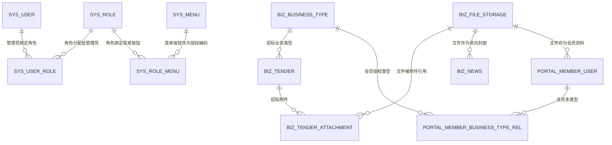

# 数据字典与ER关系

## 总体关系图

## 系统表

### `sys_user`

后台管理员账号表。

| 字段 | 含义 |
| --- | --- |
| `id` | 主键 |
| `username` | 用户名，唯一 |
| `phone` | 手机号，唯一 |
| `email` | 邮箱，唯一 |
| `password` | BCrypt 密码 |
| `real_name` | 真实姓名 |
| `company_name` | 公司名称 |
| `contact_person` | 联系人 |
| `unified_social_credit_code` | 统一社会信用代码，唯一，可空 |
| `status` | `PENDING`、`APPROVED`、`REJECTED`、`DISABLED` |
| `audit_reason`, `audited_at`, `audited_by` | 历史审核字段 |
| `last_login_at` | 最后登录时间 |
| `created_at`, `updated_at` | 审计时间 |

### `sys_role`

角色表。

| 字段 | 含义 |
| --- | --- |
| `code` | 角色编码，如 `SUPER_ADMIN` |
| `name` | 角色名称 |
| `description` | 描述 |
| `built_in` | 是否内置角色；内置角色不能删除，不能改编码 |

### `sys_menu`

菜单和按钮表，也是当前主要授权编码来源。

| 字段 | 含义 |
| --- | --- |
| `code` | 菜单/按钮编码；后端 `@PreAuthorize` 使用它 |
| `name` | 展示名称 |
| `type` | `DIRECTORY`、`MENU`、`BUTTON` |
| `parent_id` | 父节点 |
| `route_path` | 后台前端路由路径 |
| `component` | 后台前端组件路径 |
| `icon` | 图标 |
| `sort_order` | 排序 |
| `visible` | 是否显示在菜单 |
| `enabled` | 是否启用 |
| `permission_code` | 已废弃，当前保存时置空 |
| `description` | 描述 |

### `sys_user_role`, `sys_role_menu`, `sys_role_permission`

| 表 | 当前用途 |
| --- | --- |
| `sys_user_role` | 管理员账号与角色多对多 |
| `sys_role_menu` | 当前实际授权关系，角色绑定菜单/按钮 |
| `sys_role_permission` | 历史兼容关系，当前角色保存会置空 permissions |

### `sys_operation_log`

操作日志表，由 `@OperationLogRecord` 和切面写入。

| 字段 | 含义 |
| --- | --- |
| `module` | 模块名，如“招标管理” |
| `action` | 动作，如“新增招标” |
| `success` | 是否成功 |
| `operator_username` | 操作人 |
| `request_method` | HTTP 方法 |
| `request_uri` | 请求路径 |
| `ip_address` | IP |
| `detail` | 明细或错误摘要 |

## 会员与业务类型表

### `portal_member_user`

门户会员账号表。

| 字段 | 含义 |
| --- | --- |
| `username` | 会员用户名 |
| `phone` | 手机号 |
| `email` | 邮箱 |
| `password` | BCrypt 密码 |
| `real_name` | 真实姓名，可空 |
| `company_name` | 公司名称 |
| `contact_person` | 联系人 |
| `unified_social_credit_code` | 统一社会信用代码 |
| `can_download_file` | 是否允许下载招标附件 |
| `status` | `ENABLED` 或 `DISABLED` |
| `expires_at` | 会员过期时间；为空视为不能登录 |
| `last_login_at` | 最后登录时间 |
| `first_login_at` | 首次成功登录时间 |
| `deleted`, `deleted_at` | 软删除标记 |
| `business_license_file_id` | 营业执照文件 |
| `three_year_performance_file_id` | 近三年业绩证明文件 |

生产迁移中还存在 active 唯一索引相关生成列，用于支持软删除后的唯一性约束。

### `biz_business_type`

业务类型表。

| 字段 | 含义 |
| --- | --- |
| `code` | 类型编码，唯一，保存时转大写 |
| `name` | 类型名称，唯一 |
| `enabled` | 是否启用 |
| `sort_order` | 排序 |
| `description` | 描述 |

### `portal_member_business_type_rel`

会员和业务类型多对多关系表。

| 字段 | 含义 |
| --- | --- |
| `member_user_id` | 会员 ID |
| `business_type_id` | 业务类型 ID |

## 招标与文件表

### `biz_tender`

招标表。

| 字段 | 含义 |
| --- | --- |
| `title` | 标题 |
| `region` | 地区 |
| `publish_at` | 发布时间 |
| `content` | 正文，LOB |
| `contact_person` | 联系人 |
| `budget` | 预算文本 |
| `contact_phone` | 联系电话 |
| `tender_unit` | 招标单位 |
| `deadline` | 项目截止时间 |
| `project_code` | 项目编号，唯一 |
| `signup_deadline` | 报名截止时间 |
| `status` | `DRAFT`、`PUBLISHED`、`CLOSED` |
| `created_by`, `updated_by` | 创建/更新人 |
| `business_type_id` | 所属业务类型 |

### `biz_tender_attachment`

招标附件关系表。

| 字段 | 含义 |
| --- | --- |
| `tender_id` | 招标 ID |
| `file_storage_id` | 文件 ID |
| `sort_order` | 附件排序 |

### `biz_file_storage`

文件记录表。

| 字段 | 含义 |
| --- | --- |
| `original_name` | 原始文件名 |
| `content_hash` | SHA-256 内容哈希，唯一，用于去重 |
| `storage_name` | 物理存储文件名 |
| `storage_path` | 本地相对路径或 OSS object key |
| `content_type` | MIME 类型 |
| `file_size` | 文件大小 |
| `thumbnail_path` | 缩略图路径/object key |
| `thumbnail_content_type` | 缩略图 MIME |
| `thumbnail_size` | 缩略图大小 |
| `thumbnail_width`, `thumbnail_height` | 缩略图尺寸 |
| `thumbnail_status` | `READY`、`UNSUPPORTED`、`FAILED` |

## 资讯表

### `biz_news`

| 字段 | 含义 |
| --- | --- |
| `title` | 标题 |
| `cover_file_id` | 封面文件，可空 |
| `content` | 正文，LOB |
| `publish_at` | 发布时间 |
| `source` | 来源 |
| `summary` | 摘要 |
| `category` | `PLATFORM_NOTICE`、`INDUSTRY_NEWS`、`SERVICE_GUIDE`、`POLICY_REGULATION` |
| `status` | `DRAFT`、`PUBLISHED` |
| `created_by`, `updated_by` | 创建/更新人 |

关键索引：

- `idx_biz_news_status_publish_at(status, publish_at)` 支持门户公开列表。
- `idx_biz_news_category(category)` 支持分类筛选。
- `idx_biz_news_cover_file(cover_file_id)` 支持封面引用。
