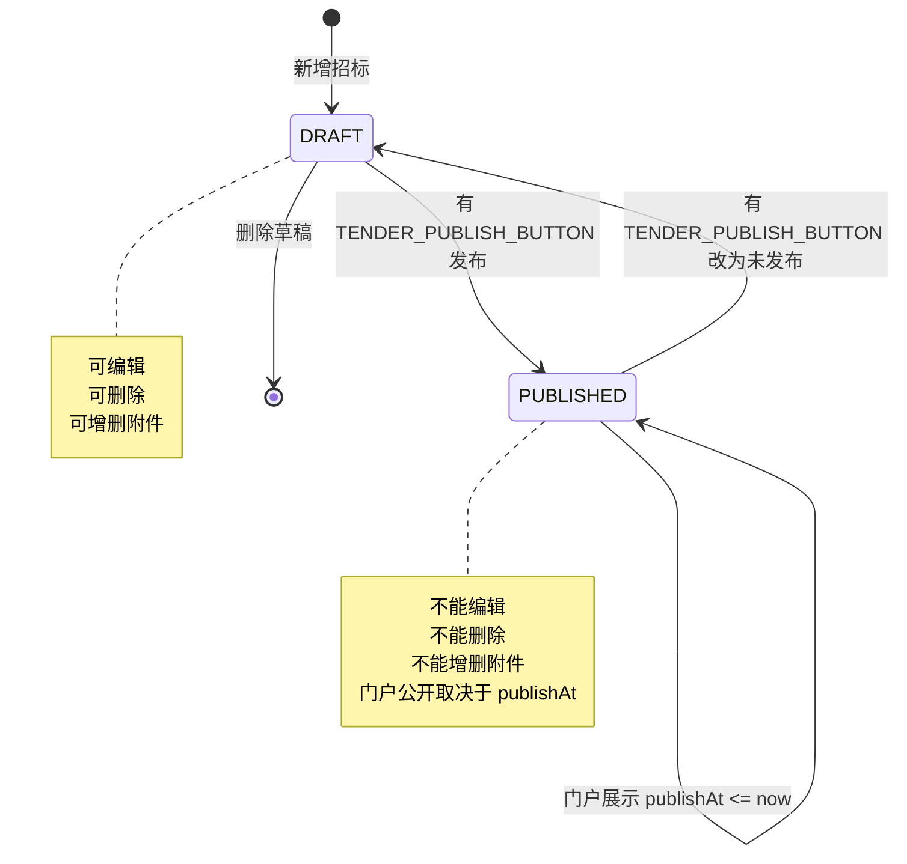
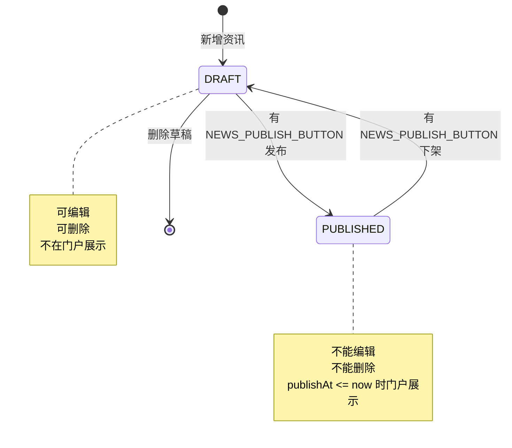
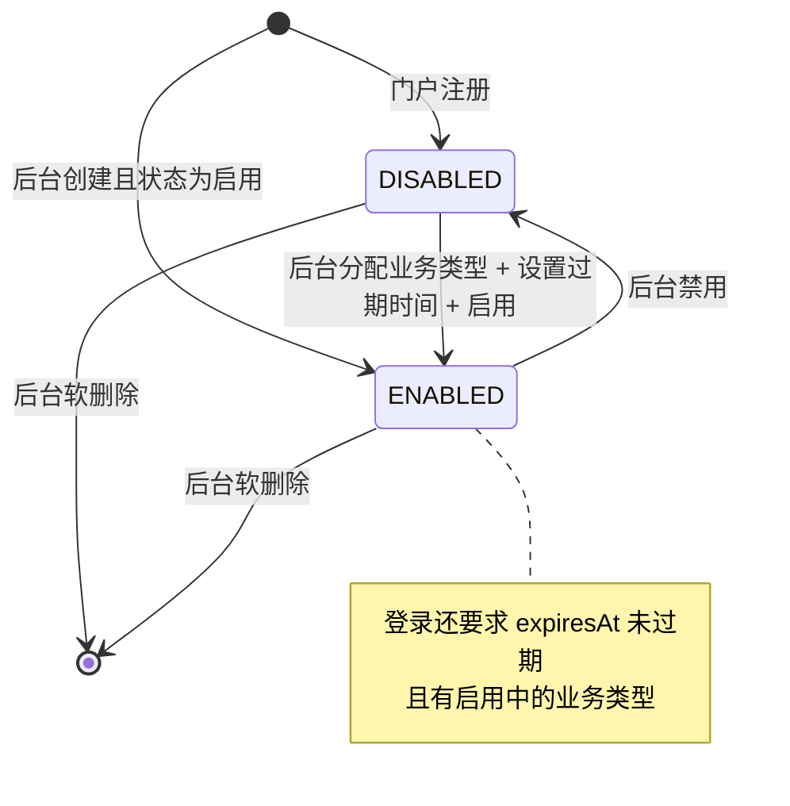
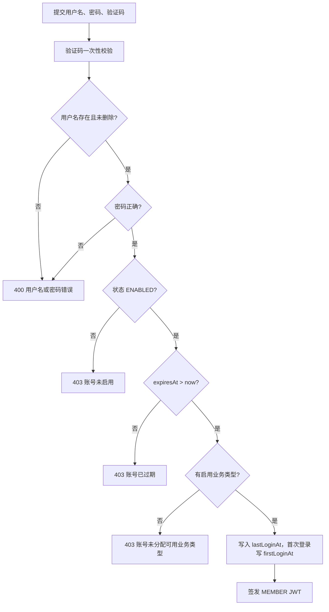
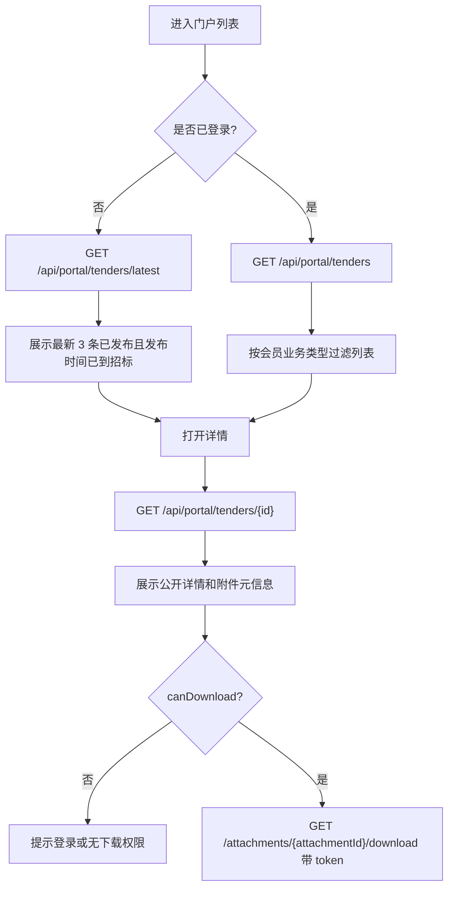
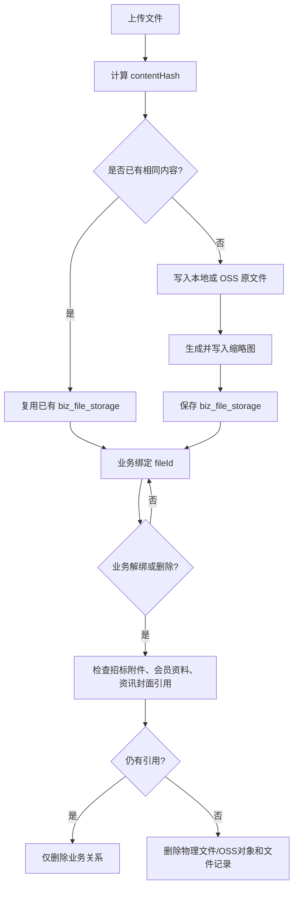

# 状态机与流程图

## 招标状态机

```mermaid
stateDiagram-v2
    [*] --> DRAFT: 新增招标
    DRAFT --> PUBLISHED: 有 TENDER_PUBLISH_BUTTON 发布
    PUBLISHED --> DRAFT: 有 TENDER_PUBLISH_BUTTON 改为未发布
    DRAFT --> [*]: 删除草稿
    PUBLISHED --> PUBLISHED: 门户展示 publishAt <= now

    note right of DRAFT
      可编辑
      可删除
      可增删附件
    end note

    note right of PUBLISHED
      不能编辑
      不能删除
      不能增删附件
      门户公开取决于 publishAt
    end note
```

保留枚举 `CLOSED`，但当前后台 status 接口拒绝设置它。

## 资讯状态机

```mermaid
stateDiagram-v2
    [*] --> DRAFT: 新增资讯
    DRAFT --> PUBLISHED: 有 NEWS_PUBLISH_BUTTON 发布
    PUBLISHED --> DRAFT: 有 NEWS_PUBLISH_BUTTON 下架
    DRAFT --> [*]: 删除草稿

    note right of DRAFT
      可编辑
      可删除
      不在门户展示
    end note

    note right of PUBLISHED
      不能编辑
      不能删除
      publishAt <= now 时门户展示
    end note
```

## 会员状态机

```mermaid
stateDiagram-v2
    [*] --> DISABLED: 门户注册
    [*] --> ENABLED: 后台创建且状态为启用
    DISABLED --> ENABLED: 后台分配业务类型 + 设置过期时间 + 启用
    ENABLED --> DISABLED: 后台禁用
    DISABLED --> [*]: 后台软删除
    ENABLED --> [*]: 后台软删除

    note right of ENABLED
      登录还要求 expiresAt 未过期
      且有启用中的业务类型
    end note
```

## 会员登录流程

```mermaid
flowchart TD
    A["提交用户名、密码、验证码"] --> B["验证码一次性校验"]
    B --> C{"用户名存在且未删除?"}
    C -- 否 --> X1["400 用户名或密码错误"]
    C -- 是 --> D{"密码正确?"}
    D -- 否 --> X1
    D -- 是 --> E{"状态 ENABLED?"}
    E -- 否 --> X2["403 账号未启用"]
    E -- 是 --> F{"expiresAt > now?"}
    F -- 否 --> X3["403 账号已过期"]
    F -- 是 --> G{"有启用业务类型?"}
    G -- 否 --> X4["403 账号未分配可用业务类型"]
    G -- 是 --> H["写入 lastLoginAt，首次登录写 firstLoginAt"]
    H --> I["签发 MEMBER JWT"]
```

## 门户招标展示流程

```mermaid
flowchart TD
    A["进入门户列表"] --> B{"是否已登录?"}
    B -- 否 --> C["GET /api/portal/tenders/latest"]
    C --> D["展示最新 3 条已发布且发布时间已到招标"]
    B -- 是 --> E["GET /api/portal/tenders"]
    E --> F["按会员业务类型过滤列表"]
    D --> G["打开详情"]
    F --> G
    G --> H["GET /api/portal/tenders/{id}"]
    H --> I["展示公开详情和附件元信息"]
    I --> J{"canDownload?"}
    J -- 否 --> K["提示登录或无下载权限"]
    J -- 是 --> L["GET /attachments/{attachmentId}/download 带 token"]
```

## 文件生命周期

```mermaid
flowchart TD
    A["上传文件"] --> B["计算 contentHash"]
    B --> C{"是否已有相同内容?"}
    C -- 是 --> D["复用已有 biz_file_storage"]
    C -- 否 --> E["写入本地或 OSS 原文件"]
    E --> F["生成并写入缩略图"]
    F --> G["保存 biz_file_storage"]
    D --> H["业务绑定 fileId"]
    G --> H
    H --> I{"业务解绑或删除?"}
    I -- 否 --> H
    I -- 是 --> J["检查招标附件、会员资料、资讯封面引用"]
    J --> K{"仍有引用?"}
    K -- 是 --> L["仅删除业务关系"]
    K -- 否 --> M["删除物理文件/OSS对象和文件记录"]
```
