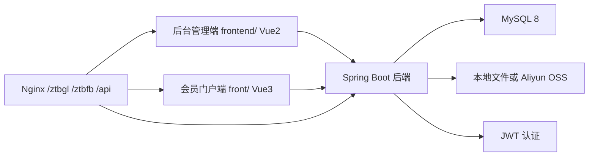
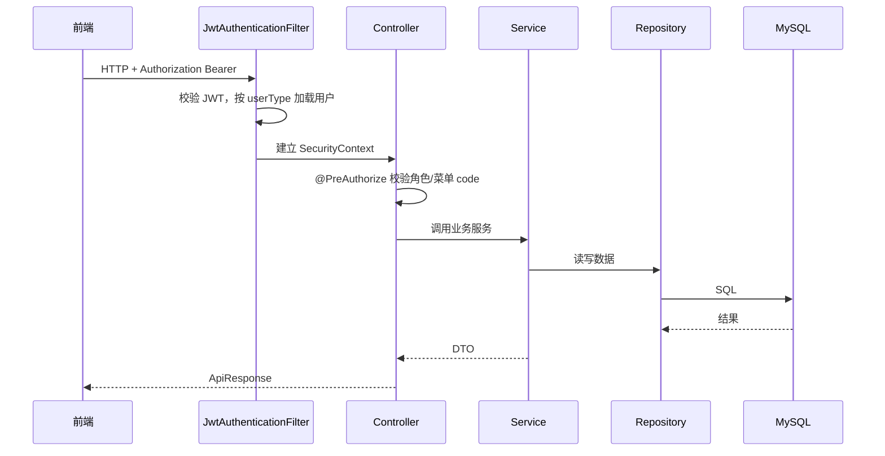

# 系统架构与代码结构

## 总体架构

## 后端分层

| 包 | 职责 |
| --- | --- |
| `controller` | REST API，参数绑定，权限注解，返回 `ApiResponse` |
| `service` | 业务规则、事务边界、文件存储实现 |
| `repository` | Spring Data JPA 查询 |
| `entity` | JPA 实体和枚举 |
| `dto` | 请求和响应对象，Bean Validation |
| `mapper` | 实体转 DTO |
| `security` | JWT、管理员/会员 UserDetails、权限主体 |
| `config` | 安全、OpenAPI、文件、JWT、生产 DB 校验、初始化 |
| `logging` | 操作日志注解和切面 |
| `common` | 统一响应、业务异常、分页结果 |

## 请求链路

## 安全架构

| 点 | 当前实现 |
| --- | --- |
| 认证 | JWT，无 session，`SessionCreationPolicy.STATELESS` |
| 用户类型 | JWT 包含 `userType`，区分管理员和会员 |
| 管理员权限 | `LoginUser` 从角色菜单生成 authorities |
| 会员权限 | `MemberLoginUser` 拥有 `ROLE_MEMBER` 和会员属性 |
| URL 放行 | 登录、门户公开资讯、门户公开招标详情/最新、公开缩略图、Swagger、静态资源 |
| 方法权限 | Controller 使用 `@PreAuthorize` |
| 密码 | BCrypt |

## 文件架构

文件服务通过 `FileStorageService` 抽象：

| 实现 | 激活条件 | 特点 |
| --- | --- | --- |
| `LocalFileStorageService` | `APP_FILE_TYPE=local` 或未配置 | 写本地目录，适合本地和测试 |
| `OssFileStorageService` | `APP_FILE_TYPE=oss` | 写 OSS，支持 access-key 和 ecs-ram-role |

缩略图由 `FileThumbnailGenerator` 统一生成，文件响应由 `FileResponseBuilder` 设置下载或 inline 头。

## 操作日志架构

操作日志用于审计业务动作，入库到 `sys_operation_log`，由 `@OperationLogRecord` 和 `OperationLogAspect` 统一记录。当前覆盖标准：

- 后台和门户的 `POST`、`PUT`、`DELETE`、`PATCH` 变更入口必须加 `@OperationLogRecord`。
- 下载类敏感读取也必须加操作日志，例如后台文件下载、会员下载招标附件。
- 普通列表、详情、选项、验证码、缩略图、文件预览、操作日志查询本身不入库，避免高频查询造成日志膨胀。
- 已停用但仍暴露的旧变更入口也记录失败尝试，便于排查误调用或旧前端残留调用。

切面记录：

- 模块。
- 动作。
- 操作人。
- 请求方法和 URI。
- IP。
- 成功/失败。
- 错误摘要。

查询入口是 `GET /api/admin/operation-logs`。

文件日志用于排查运行问题，不替代操作日志。当前关键运行日志包括：

- 未处理系统异常：`GlobalExceptionHandler` 记录 `ERROR`。
- `BusinessException` 的 `code >= 500`：按运行故障记录 `ERROR`；普通 400/403 业务校验不写文件日志。
- 操作日志入库失败：`OperationLogAspect` 记录 `ERROR`，但不阻断主业务。
- 安全拒绝：403 访问拒绝记录 `WARN`；未认证访问和 token 对应账号不可用记录 `DEBUG`。
- 文件处理：缩略图生成失败记录 `WARN` 摘要和 `DEBUG` 详情；本地/OSS 补偿清理失败记录 `WARN`。

## 代码边界原则

- Controller 不直接写复杂业务规则，应委托 Service。
- Service 是事务边界。
- JPA 实体只表达数据结构，不承载复杂流程。
- 前端不要拼后端存储路径。
- 数据库变更不只依赖 Hibernate；生产脚本在 `sql/mysql8/`。

## 当前架构注意点

- `DataInitializer` 当前不是主启动自动 Bean；空库初始化不能假设自动发生。
- `Permission` 实体和权限页面是历史兼容，当前授权以菜单/按钮 code 为准。
- `TenderStatus.CLOSED` 是保留枚举，当前 status 接口不允许设置。
- 双前端必须区分：`frontend/` 是后台，`front/` 是门户。
