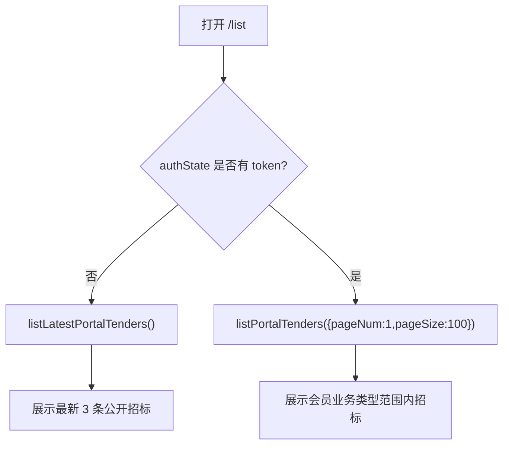

# 双前端页面路由与联动

## 两个前端的边界

| 前端 | 目录 | 技术栈 | 生产 base | 用户 |
| --- | --- | --- | --- | --- |
| 后台管理端 | `frontend/` | Vue 2.6 + Vue CLI 3 + View Design | `/ztbgl/` | 管理员 |
| 门户端 | `front/` | Vue 3.2 + Vite 2 | `/ztbfb/` | 游客和会员 |

说“前端”时必须确认是哪一个。

## 后台管理端路由

主要路由来自 `frontend/src/router/modules/*`。

| 页面 | 路由 | 组件 | 后端菜单 code |
| --- | --- | --- | --- |
| 工作台 | `/dashboard/console` | `dashboard/console` | `DASHBOARD` |
| 个人中心 | `/profile/index` | `profile/index` | `PROFILE` |
| 管理员管理 | `/system/user` | `sys/user` | `SYSTEM_ADMIN_USER` |
| 会员管理 | `/system/member` | `sys/member` | `SYSTEM_MEMBER_USER` |
| 类型管理 | `/system/business-type` | `sys/business-type` | `SYSTEM_BUSINESS_TYPE` |
| 资讯管理 | `/system/news` | `sys/news` | `SYSTEM_NEWS` |
| 招标管理 | `/tenders` | `sys/tender` | `SYSTEM_TENDER` |
| 角色管理 | `/system/role` | `sys/role` | `SYSTEM_ROLE` |
| 菜单管理 | `/system/menu` | `sys/menu` | `SYSTEM_MENU` |
| 操作日志 | `/log` | `system/log` | `SYSTEM_OPERATION_LOG` |

后台侧边栏来自登录后 `/api/auth/me` 返回的 `menus`。如果页面存在但菜单不显示，先查角色菜单绑定。

## 后台请求封装

核心 API 文件：

```text
frontend/src/api/system.js
frontend/src/plugins/request/index.js
```

重要行为：

- API base 是 `/api`。
- `code` 为 `0` 或 `200` 才按成功处理。
- `401`/`10001` 类登录态错误会跳登录。
- 文件下载和预览使用 `fetch` 手动带 token，处理 blob。

## 后台按钮权限

后台页面用 `v-auth` 控制按钮显示。

例子：

- 招标新增：`TENDER_CREATE_BUTTON`。
- 招标发布/取消发布：`TENDER_PUBLISH_BUTTON`。
- 资讯发布/下架：`NEWS_PUBLISH_BUTTON`。
- 会员下载权限：`MEMBER_DOWNLOAD_BUTTON`。

前端隐藏按钮只是体验，后端 Controller 仍有 `@PreAuthorize` 做强校验。

## 门户端路由

路由文件：`front/src/router/index.js`。

| 页面 | 路由 | 认证 |
| --- | --- | --- |
| 登录 | `/login` | 未登录访问 |
| 注册 | `/register` | 未登录访问 |
| 招标列表 | `/list` | 游客/会员 |
| 分类公告 | `/list/category` | 会员列表接口，需要登录 |
| 招标详情 | `/detail/:id` | 公开 |
| 资讯列表 | `/news/list` | 公开 |
| 资讯详情 | `/news/:id` | 公开 |
| 账户设置 | `/setting` | 会员登录 |

门户 token 存储：

```text
localStorage key: zb_portal_auth
```

## 门户列表联动



登录成功后必须刷新列表，不能继续用游客最新 3 条结果。

## 门户下载联动

详情页调用 `getPortalTenderDetail` 后得到：

- `attachments`
- `canDownload`

如果 `canDownload=false`：

- 未登录：提示登录。
- 已登录：提示无下载权限。

真正下载时调用 `downloadPortalAttachment`，由后端再次校验。

## 构建与部署

后台：

- `frontend/src/setting.env.js` 生产 `publicPath=/ztbgl/`。
- 构建命令：`npm run build:prod`。
- 输出：`frontend/dist`。

门户：

- `front/vite.config.js` 生产 `base=/ztbfb/`。
- 构建命令：`npm run build`。
- 输出：`front/dist`。

Nginx 必须支持 history 路由刷新，否则 `/ztbgl/...` 或 `/ztbfb/...` 子路径刷新可能 404。
